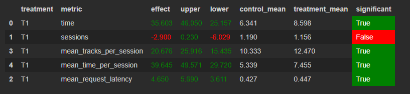

# Отчёт
### 1. Основная идея эксперимента
Эксперименты с доработкой нейросетового рекомендера не дало значительного улучшения (в частности попытки добавить модели типа RNN).

В итоге взят базовый нейросетевой рекоммендер и доработана выдача треков: вместо случайного рекоммендера взят топ-100, добавлена история пользователя: треки в зависимости от продолжительности прослушивания разделяются на плохие (эксперименты показали что наилучший результат получается при time < 0.4) и хорошие (time > 0.8).

В случае получения плохого результата по предыдущиму треку выбираем один из предыдущих хороших треков и берем рекоммендацию нейросетевого рекоммендера (вероятность получения новой хорошей рекоммендации выше, чем попытки дальше предсказывать по плохому треку, что было реализовано в базовой версии).

### 2. Детали:
Создан класс для хранения истории пользователя (в силу того, что мы имеем дело с симулятором, то считаем, что при каждом перезапуске нет прошлой истории пользователя), фактически - это отображение id пользователя и его истории прослушивания, что используется при рекоммендации следующего трека.

### 3. Результаты


# Инструкция
Изменений в запуске нет, запуск проходит также как и на занятиях (согласно описанием соответсующих readme).

Запуск для сбора данных:
```
python sim/run.py --episodes 5000 --config config/env.yml single --recommender remote --seed 31337
```
